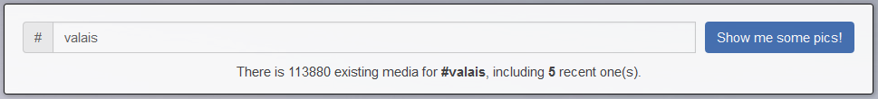
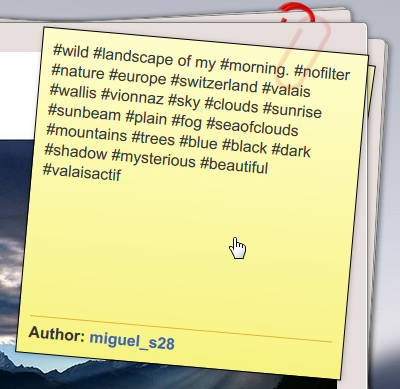

# [Swipe.Me](https://github.com/edri/Swipe.Me)

## First note - Important
Because the website is still in sandbox mode, everybody cannot access it. If you *really* want to try it out, just send me an [email](mailto:miguel.santamaria@heig-vd.ch) and I'll be proud to give you an access. If you also have some feedbacks I'll be happy to read them!
The sandbox mode also have another big disadvantage: you cannot access any of the users' pictures but mine (which is not totally useless for me because I can get some free likes, hehe). To ensure you'll correctly find pictures, please enter one of the following hashtags: **#europe** (>= 18 available pictures), **#trip** (>= 11 pictures), **#valais** (>= 5 pictures), **#spain** (>= 1 picture(s)), ...

I made all my tests on Firefox and on Chrome, so don't blame me if there is still some issues in other browsers, I'll correct them.

## Information

### What is Swipe.Me?
Swipe.Me is a Instagram non-official application, which allows you to swipe pictures to either reject or like them : left swipe to reject, right swipe to like!

### How to use it?
First thing first, you **must** have an Instagram account. If you still don't own one, just [click here](https://www.instagram.com/).  
Once done, nothing easier! Just go to the [website](http://swipe-me.herokuapp.com/), read the policy, and finally login with your Instagram account by clicking the "Login" button (yeah, really hard).
I can see you guys going: *"Hey, how can I be sure you won't take all my data and sold them to everybody?"*. Well, that's an excellent question: first of all, it is written in the website's policy so you have my word ("Yeah, sure..."), then just feel free to check this repository to ensure I didn't hide some malicious code, and finally I just cannot access the user's password because of the connection process, which is provided and controlled by Instagram itself!

You will then be redirected to the swiper page, in where you'll be able to search for a hashtag and swipe between pictures: enter the hashtag you want to search in the input field (e.g. *"#foodporn"*, 'cause everybody likes food ; I could say *"#cat"*, too), and then click on the "Show me some pics!" button. You can firstly see details relating to the entered hashtag.  

After a few seconds you'll be able to access pictures related to the entered hashtag.  

If you want to have more details on the picture, just move the cursor on the yellow note to enlarge it. You can then read the picture's description and click on the author if you want more information.  
  
If you want to hide to note so you can see the entire picture, just move the cursor on the picture.  
You can access the image's Instagram page by clicking on it, too.

Just swipe between pictures by pressing either the "Reject" (or left-arrow key) or the "Like" (or right-arrow key) buttons. Isn't it beautiful?  

If you already liked the picture once in your life, the "Like" button will already be marked.  
  
If you swipe on the right nothing new will happen, but if you swipe the picture left your "Like" will be dismissed and the picture disliked.

## Coding process

### Introduction
I coded this project with Node.js and the *express* framework (built with Yeoman) for the server side, and with AngularJS for the client one. I also used Npm, Bower, Jade, etc.

## Available pages
There is currently only one router (`/routes/index.js`) containing two different elements.

1. Physical pages (linked to Jade views):
    * `/` => Home page, which can be only accessed by the non-connected users.
    * `/policy` => Policy page, which can be accessed by everybody.
    * `/swiper` => Swiper page, which can be accessed only if the user is connected.
2. Non-Physical pages (no views):
    * `/auth` => Sends an access token request to the Instagram API so the user who's trying to connect can either access or not the Swiper page (more details on the **Instagram API** chapter).
    * `/logout` => Logs the user out and redirect him back to the Home page.
    * `/isSessionActive` => Returns a boolean value, indicating if the user's session is currently still active (*true*) or not (*false*) ; used when the user clicks on the "Show me some pics!" button.
    * `/action/:action_type/:picture_id` => Does a "Like" or "Dislike" action (depending on the given `action_type`, which can be "like" or "dislike") on the picture identified by the `picture_id` ID.

### Instagram API
First of all the user need to connect Instagram in order to get an access token to the Swipe.Me application. The connection process is made in two times.

1. The user clicks on the "Login" button and is redirect to the official Instagram's connection page, in where he can enter his name and password, and then accept or not the access to the application. The link linked to the button contains the application's public client's ID, the scope rights ("access public content", and "like"), and the URL (`[swipe.me host name]/auth`) called after the login process succeeded or not.
2. Instagram checks the validity of the given information and calls back the Swipe.Me's server on the `/auth` link. From there, there is two cases:
    1. An error occured (the user rejected the access) => redirects the user to the Homme page with an error to display.
    2. We received a success result with the precious access token and the user's name => save those variables in the server's session and redirect the user to the Swiper page.

Once connected, there is three kinds of possible requests that can be sent to the Instagram API server.

1. Asks for the number of medias that have the given hashtag: **GET** on `https://api.instagram.com/v1/tags/{tag-name}?access_token=ACCESS-TOKEN`, where `tag-name` is the tag's name (without '#') and `ACCESS-TOKEN` is the current user's access token. This request is made with JSONP to avoid cross-origin issues.
2. Asks for the details of all recent pictures related to the given hashtag: **GET** on `https://api.instagram.com/v1/tags/{tag-name}/media/recent?access_token=ACCESS-TOKEN`, where `tag-name` is the tag's name (without '#') and `ACCESS-TOKEN` is the current user's access token. This request is also made with JSONP to avoid cross-origin issues.
3. Likes or dislikes a media: POST (like) or DELETE (dislike) on `https://api.instagram.com/v1/media/{media-id}/likes?access_token=ACCESS-TOKEN`, where `media-id` is the concerned media's ID (received in the 2. point) and `ACCESS-TOKEN` is the current user's access token. Because this request is not a **GET** method we need to pass by the server (`/action/...`) to avoir cross-origin issues.

You can find more information about the Instagram API's endpoints [here](https://www.instagram.com/developer/endpoints/).

### AngularJS part
The AngularJS' part is related to the Swipe page. It contains one controller, which use scope, http (requests) and window (redirections) variables' scopes. There is some private functions, and other public ones related to the scope in it. Everything is well commented so don't be shy and feel free to check out my code! :)  
